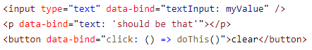

# Knockout Binding Support

## 🚧 Experimental 🚧

The extension is experimental and still under development. New features will be added in the future, see [planned features](#planned-features).

## Features

### Syntax Highlighting

### Planned Features

- Language Service Features – intellisense, go-to-definition, type checking, etc..
- Custom binding attributes
- Snippets
- Support for "mustache" syntax

## Known Issues

- `data-bind` syntax highlighting works everywhere – due to [limitations](https://github.com/microsoft/vscode-textmate/issues/160) in the injection selector, the injection cannot be limited to just elements.